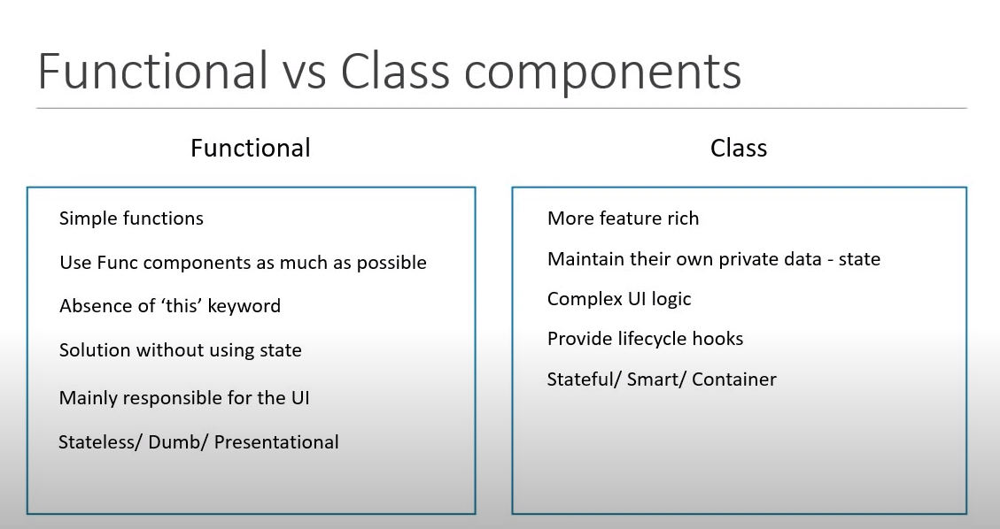

# What are the components in react?
    => Components describe a part of the user interface.
    => Components are reusable and nested inside another component.
    => There are 2 types of components in react:
        1) Stateless functional component
        2) Stateful class component

# Stateless Functional Components 
    => 